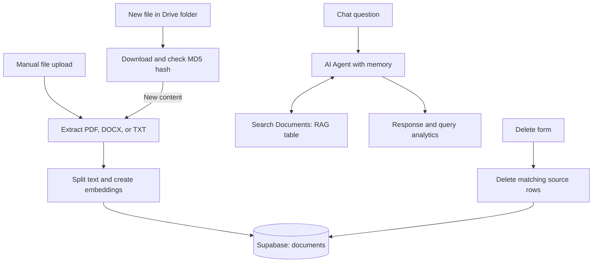

# AI RAG Chatbot & Knowledge Base

**Document-based question answering with manual uploads, automatic Google Drive ingestion, source references, and query analytics.**

**Stack:** n8n · OpenAI · Supabase vector store · Google Drive · Google Sheets

This project contains three independently triggered workflows that are intended to share a knowledge base. They do not call each other directly.

## Workflow files

| File | Responsibility | Nodes |
| --- | --- | --- |
| [AI RAG Chatbot](workflows/ai-rag-chatbot.json) | Manual document upload, extraction and storage; chat retrieval, source-name responses, memory, and analytics. | 17 |
| [Auto Document Ingestion](workflows/auto-document-ingestion.json) | Watch a Drive folder, download new files, check content hashes, and insert document chunks. | 16 |
| [Delete Document from Knowledge Base](workflows/delete-document.json) | Form-triggered removal of stored rows by a source-filename filter. | 2 |

**Status:** Sanitized exports with static structure checks. Live n8n import, retrieval quality, and external integrations have not been tested during publication. The table mismatch described below must be resolved before treating the workflows as a connected system.

## Purpose

Turn document content into a searchable knowledge base, answer questions with source filenames, and reduce repetitive document ingestion work. A separate maintenance workflow removes stored document chunks.

## Architecture

The diagram shows the exported table names: ingestion writes to **documents**, while retrieval is configured for **RAG**. No synchronization between those tables is supplied.

## Implemented workflow design

### Manual ingestion and chat

The upload form accepts PDF, DOCX, and TXT. A Switch routes files to PDF extraction, text extraction, or DOCX extraction using **mammoth**. The original filename is stored in `source` metadata. A recursive text splitter uses **200 characters of overlap**, and OpenAI embeddings feed a Supabase insert node.

The chat branch uses **gpt-4o-mini**, simple memory, and a Supabase retrieval tool with **topK = 10**. Its prompt asks for source filenames, admissions when information is unavailable, and focus on a named document when requested.

Google Sheets analytics records:

`Timestamp, Question, Answer, Source Document, Answer Found`

The “Answer Found” field is a phrase-based heuristic, not an independent correctness score.

### Automatic ingestion

Google Drive is polled every minute for **new files in one selected folder**. Downloaded file bytes are hashed with MD5, and Supabase is queried for matching `metadata.file_hash`.

Detected duplicates follow a no-operation branch. New content follows format-specific extraction and storage with both `source` and `file_hash` metadata. This export watches file creation; it does not implement automatic synchronization of edits, renames, or Drive deletions.

### Document deletion

The form sends a DELETE request to the `documents` table using:

`metadata->>source = ilike.*<entered filename>*`

This is a **case-insensitive partial match**, not an exact filename match. It can remove chunks belonging to multiple files. Empty or wildcard input can broaden the match substantially. No confirmation or preview branch is included.

The workflow removes database rows only; it does not delete the original Google Drive file.

## Setup

1. Import all three JSON files. The published exports are inactive.
2. Reconnect OpenAI, Supabase, Google Drive, and Google Sheets credentials.
3. Replace `YOUR_PROJECT_REF`, `YOUR_DRIVE_FOLDER_ID`, and `YOUR_ANALYTICS_SHEET_ID`; select the analytics worksheet.
4. Provision the Supabase vector table and retrieval function expected by the nodes. Database schema and SQL are not included.
5. Align the storage, retrieval, and deletion table configuration. Confirm whether `RAG` is an intentional external view/table or should point to `documents`.
6. Select matching embedding models and vector dimensions for insertion and retrieval. The embedding model is not explicitly pinned in the exports.
7. Ensure the n8n Code-node runtime supports the required `mammoth` dependency and `crypto` module.
8. Create the analytics headers listed above and check the binary field mappings: `Upload_PDF` for form uploads and `data` for Drive downloads.
9. Test upload, retrieval, duplicate detection, analytics, and deletion using disposable documents before activating the workflows.

## Validation items

- **Table alignment:** Upload and delete use `documents`; search uses `RAG`. Verify the intended schema rather than assuming uploaded files are searchable.
- **Deletion safeguards:** Replace broad matching with an exact document identifier, reject empty/wildcard input, and add a preview/confirmation step before regular use.
- **Access:** The chat trigger has `public: true`. Review chat and form access before connecting private documents, especially the deletion form.
- **Tool description:** Search Documents uses `$json.pageContent` as its description; verify that this exists for chat input or supply a stable description.
- **Document listing:** A top-10 semantic search cannot guarantee a complete file inventory. The prompt's requested filename list can be incomplete.
- **Named-document questions:** Scope is requested in the prompt, but no explicit metadata filter enforces it.
- **Source handling:** The prompt requires a source suffix even when no answer is found. Test this case so the assistant does not invent filenames.
- **Duplicate scope:** Manual uploads do not add a file hash. Hash checks on the Drive branch do not deduplicate every ingestion path and are not an atomic uniqueness guarantee.
- **Empty query results:** Confirm that Evaluate Duplicate runs when the hash lookup returns no records.
- **Format boundaries:** Extension matching is case-sensitive. Test uppercase extensions, unsupported formats, multiple uploads, and scanned PDFs; there is no OCR node.
- **Runtime dependencies:** DOCX parsing needs mammoth in the actual Code-node environment, not just valid JSON.
- **Chat delivery:** The chat branch ends at the analytics node. Verify the final user-visible response and behavior when Sheets logging fails.
- **Retrieved content:** Test untrusted document instructions and ensure answers remain grounded in retrieved evidence.

Original prompts, processing logic, and connections are preserved. These are review findings, not claims that fixes or end-to-end tests have been completed.

## Publication checks

Removed credential bindings, pinned execution data, instance metadata, and private resource IDs/URLs. JSON parsing and connection-target checks passed for all three files. No ingestion, chat, or DELETE request was executed.

---

[Back to profile](../../README.md)
