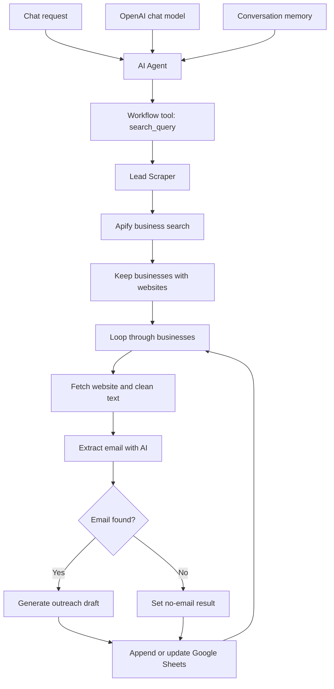

# Lead Scraper & AI Agent

**Conversational local-business discovery, website email extraction, and outreach draft preparation.**

**Stack:** n8n · Apify Google Places actor · OpenAI · Google Sheets

The **Lead Scraper is the main processing workflow**. The **Lead Gen AI Agent calls it as a tool**, passing a business type and location in `search_query`. Together they form one project.

## Workflow files

| Workflow | Role | Nodes |
| --- | --- | --- |
| [Lead Scraper](workflows/lead-scraper.json) | Main workflow: business discovery, website processing, email extraction, draft generation, and Sheets storage. | 12 |
| [Lead Gen AI Agent](workflows/lead-gen-ai-agent.json) | Chat interface with an OpenAI model, conversation memory, and a tool that calls Lead Scraper. | 5 |

**Status:** Sanitized exports available. JSON structure and connection targets checked; n8n import and live integrations have not been tested during publication.

## What the project solves

Finding local businesses, visiting their websites, collecting contact details, and preparing an initial outreach draft involves repetitive work. This system accepts a request such as **“Find interior designers in Lahore”** and delegates the processing to a reusable workflow.

## Architecture

## Main workflow behavior

1. Receive a `search_query` from another workflow.
2. Call Apify's `compass~crawler-google-places` actor, requesting up to **20 places per search** in English.
3. Filter out businesses without a website.
4. Fetch each website with a 10-second request timeout.
5. Remove scripts, styles, comments, and HTML tags. For long content, retain the first and last 4,000 characters with a separator.
6. Ask **gpt-4o-mini** to select one business contact email or return `Not Found`.
7. Format business name, website, phone, address, and the extracted email.
8. If an email is found, generate a **60–80-word outreach draft**. Otherwise, store the no-email result.
9. Append or update Google Sheets using **Website** as the matching column, then continue the loop.

The model is prompted to reject placeholder addresses. This is **AI-assisted extraction**, not mailbox verification or a deliverability check. There is no email-sending node.

## Agent behavior

The chat-triggered agent uses **gpt-4o-mini** and simple conversation memory. Its workflow tool maps an AI-generated `search_query` to the Lead Scraper input. The system prompt asks it to report completion and direct the user to Google Sheets.

## Setup

1. Import **Lead Scraper first**, then import **Lead Gen AI Agent**.
2. Open the agent's **Call 'Lead Scraper'** tool and select the newly imported Lead Scraper workflow. Replace `YOUR_LEAD_SCRAPER_WORKFLOW_ID`; workflow IDs are different in each n8n instance.
3. Confirm that `search_query` maps to the scraper's workflow input.
4. Configure Apify authentication in the first HTTP Request node. Replace the token placeholder using your own secure n8n credential configuration.
5. Reconnect OpenAI credentials in both workflows and Google Sheets credentials in the scraper.
6. Replace `YOUR_GOOGLE_SHEET_ID`, select the worksheet, and create these headers:

   `Business Name, Website, Phone, Address, Emails, Outreach Draft`

7. Customize the outreach category and your actual service offer.
8. Test with a small query, inspect saved rows, and verify the agent's completion response before enabling regular use.

Both published workflows are inactive and require configuration.

## Implementation notes and validation items

- **Outreach category is fixed:** The prompt currently uses “Interior Design / Home Services,” even if the agent accepts another business category. Make the category dynamic before using other niches.
- **Grounded outreach:** The draft prompt receives business name and address, but no service evidence or specific offer. Review compliments and claims, and supply verified context.
- **Website scope:** Businesses without websites are excluded. The scraper fetches the supplied website URL; it does not explicitly crawl contact pages. Tag removal can also discard emails present only in link attributes.
- **Email validation:** The workflow checks the model's text against `Not Found`; it does not independently validate mailbox ownership or delivery.
- **TLS:** The website HTTP node currently allows unauthorized certificates. This original setting is preserved; enable certificate verification for regular use.
- **Failures and empty results:** Test inaccessible sites, request timeouts, empty Apify results, and searches where every website is filtered out.
- **Tool return:** The loop's Done output has no connected summary node. Verify what the caller receives, and add an explicit result summary if needed so completion messages reflect actual saved results.
- **Matching:** Sheets updates by the exact Website value. URL variants may produce separate records, while businesses sharing a website may overwrite a row.
- **Input handling:** The Apify body directly interpolates the query into JSON. Validate queries containing quotes and use safe JSON serialization.
- **Untrusted website text:** Test extraction against pages containing instructions intended to influence the model.

The original processing logic and connections are preserved. These notes describe the supplied implementation, not completed fixes or live test results.

## Publication verification

Credential bindings, embedded Apify token, spreadsheet and workflow identifiers, pinned data, and instance metadata were removed or replaced. Both exports passed JSON parsing and connection-target checks.

---

[Back to profile](../../README.md)
