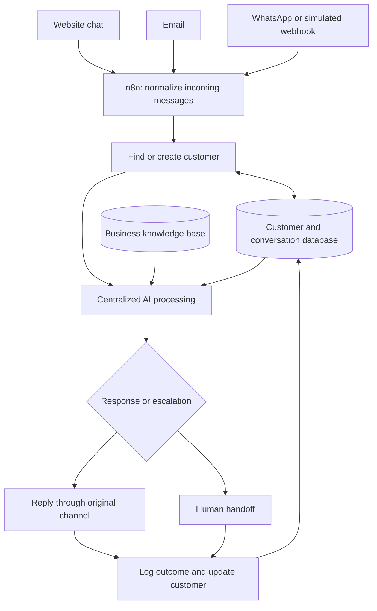

# Multi-channel AI Agent
### Centralized customer conversations with n8n

**Status: In development · Internship project at Big Brain**

A customer should be able to contact a business through website chat, email, or WhatsApp without being treated as a different person on every channel. This project is designed to bring those interactions into one automation system with a shared customer profile, conversation history, knowledge base, and AI decision process.

> This page documents the project design and implementation roadmap. It is not a release of the complete working system. Workflow exports and demonstration assets are not included here yet.

## Business problem

Disconnected communication channels fragment customer information, repeat questions, and make support harder to manage. The proposed system connects channel-specific inputs to shared customer records and business logic.

## Architecture

## Implementation scope

| Layer | Responsibility |
| --- | --- |
| Channel intake | Receive website, email, and WhatsApp messages; allow a webhook simulation for WhatsApp. |
| Normalization | Standardize sender details, message content, channel, timestamp, and message ID. |
| Customer identity | Match using available identifiers and create or update a shared customer profile. |
| Conversation storage | Associate incoming messages and responses with the customer record. |
| AI understanding | Classify intent, urgency, required information, and escalation needs using structured JSON. |
| Knowledge grounding | Use shared business information and avoid inventing unsupported answers. |
| Response routing | Adapt the answer format and return it through the original channel. |
| Human handoff | Summarize the issue, flag the customer record, and pause inappropriate automated replies. |

## Technology direction

- **n8n** for workflow orchestration, webhooks, branching, and integrations.
- **Supabase** for the simulated customer and conversation database.
- **Website chat and email** for channel intake.
- **Webhook simulation** for WhatsApp during development.
- **An n8n-supported LLM provider** for planned centralized AI processing.

## Data model

**Customers:** customer ID, name, email, phone, company, preferred channel, first interaction, last interaction, and customer status.

**Conversations:** conversation ID, customer ID, channel, message ID, message, sender type, timestamp, intent, and response.

Customer matching requires sufficient identifying information. A matching display name alone should not be treated as proof that two conversations belong to the same person.

## Development roadmap

1. Set up n8n and design the multi-channel architecture.
2. Collect and standardize incoming messages.
3. Maintain unified customer records and conversation logs.
4. Introduce centralized AI intent understanding.
5. Connect the shared business knowledge base.
6. Route responses to the correct channel.
7. Retrieve context across channel changes.
8. Add human escalation and handoff.
9. Integrate the complete pipeline.
10. Test edge cases, document the implementation, and record a demonstration.

These are project milestones, not a claim that all phases have been completed.

## Validation plan

Use at least 30 fictional scenarios covering new and returning customers, channel switching, missing identifiers, duplicate messages, unanswered knowledge-base questions, and human handoff. Confirm that customer records stay consistent and that responses are logged against the correct customer.

## Portfolio deliverables planned

- Sanitized n8n workflow exports.
- Setup and configuration instructions.
- Fictional CRM and knowledge-base samples.
- AI prompts and structured output examples.
- Test results and a recorded demonstration.

Only fictional business information and sanitized test data should be published. Credentials and private customer details belong outside the repository.

---

[Back to profile](../README.md)
