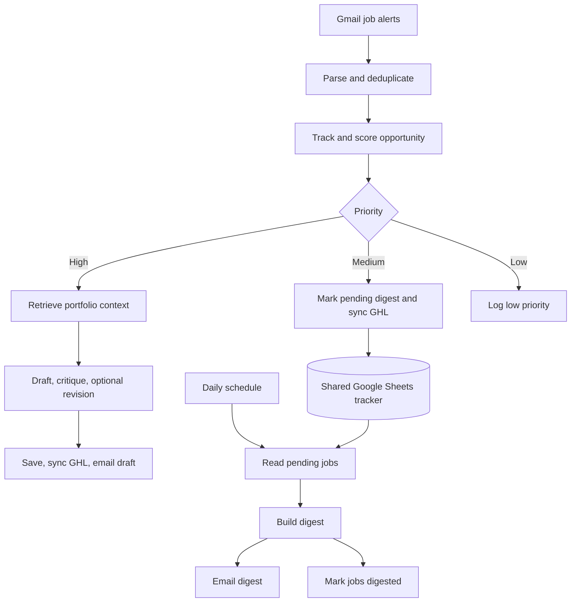

# Upwork Opportunity Assistant

**AI opportunity screening, portfolio-grounded proposal drafts, and a companion daily digest.**

**Stack:** n8n · Gmail · Google Sheets · OpenAI · Supabase · GoHighLevel

This project helps a freelancer review incoming opportunities, prioritize suitable work, and prepare a draft for manual review. It contains **two connected workflows sharing one Google Sheets tracker**.

## Workflow files

| File | Role | Nodes |
| --- | --- | --- |
| [Upwork Opportunity Assistant](workflows/upwork-opportunity-assistant.json) | Main workflow: intake, deduplication, scoring, portfolio retrieval, proposal drafting and review, CRM sync, and alerts. | 29 |
| [Daily Medium Priority Digest](workflows/daily-medium-priority-digest.json) | Companion workflow: collect pending medium-priority jobs, email a digest, and update tracker statuses. | 6 |

**Release status:** Sanitized workflow exports with static inspection completed. External integrations have not been executed or verified as part of publication. Setup and the validation items below are required before activation.

## How the main workflow works

1. Poll Gmail every minute for messages matching the configured **vollna.com** sender filter.
2. Parse the alert subject and text for title, description, hourly/fixed budget, client signals, and the decoded Upwork URL.
3. Extract the job ID and compare it with existing Google Sheets records.
4. Save new jobs and ask **gpt-4o-mini** to evaluate skill match, project fit, budget, client quality, competition, and requirements clarity.
5. Route by opportunity score:
   - **High:** score at least 70; embed the job and retrieve a relevant portfolio project.
   - **Medium:** intended range 60–69; mark it pending digest and sync a GHL opportunity.
   - **Low:** intended range below 60; log it without generating a proposal.
6. For high-priority jobs, create an embedding using **text-embedding-3-small** and call the Supabase **match_portfolio_projects** RPC with a 0.5 similarity threshold and one requested match.
7. Draft a personalized proposal, critique it for relevance and unsupported claims, and perform one revision plus a second critique when requested.
8. Save the draft and quality score, sync to GHL, and send an email for **human review and manual submission**.

No node submits proposals on Upwork.

## Architecture

The diagram reflects the exported connections, including the digest's separate email and status-update branches.

## Companion workflow

The schedule is configured for **09:00 in the effective n8n workflow/instance timezone**. No explicit timezone is present in the export.

It reads rows with status `Medium Priority - Pending Digest`, builds an HTML email with titles, scores and links, and updates matching job IDs to `Medium Priority - Digested`. This is part of the main project's notification system, not a separate portfolio project.

## Setup

1. Import both JSON files into a compatible n8n instance. Both published copies are inactive.
2. Reconnect credentials for Gmail, Google Sheets, OpenAI, Supabase HTTP requests, and GoHighLevel HTTP requests.
3. In every Google Sheets node, replace `YOUR_GOOGLE_SHEET_ID` and select the correct worksheet.
4. Create these tracker headers:

   `job_id, title, job_url, date_detected, status, score, proposal_text, proposal_quality_score`

5. Set both email recipients from `you@example.com` to your own address.
6. Configure the Supabase project URL and authentication. The placeholders are not working credentials; configure secrets through n8n credentials rather than publishing them in JSON.
7. Supply the external portfolio database and `match_portfolio_projects` RPC. They are not included in these exports. Expected portfolio fields include `project_name`, `problem`, `solution`, `results`, and `similarity`; embeddings must match the selected embedding model.
8. Replace GHL pipeline, location, and stage placeholders and verify the request against your account configuration.
9. Customize the freelancer profile, rate, and prompts. The export contains an illustrative profile used by the original workflow.
10. Set the desired timezone, run controlled tests, and resolve the validation items before activation.

## Validation items found during static review

- **Portfolio response shape:** Several proposal/critic expressions reference `Find Best Match.item.json[0]`, while the fallback node expects a project object. Align these expressions with the actual HTTP response shape and consistently use the normalized fallback output.
- **Empty results:** Verify execution on an empty tracker, an empty portfolio search, and a day with no digest jobs. The presence of fallback code does not guarantee it runs when the preceding node emits no items.
- **Digest delivery:** Email and status updates branch independently. Update statuses only after confirmed email delivery to avoid marking unsent jobs as digested. The `hasJobs` flag currently has no IF gate.
- **Score boundary:** Medium uses `>=60` and Low uses `<=60`, so the rules overlap at 60. Confirm first-match behavior or make the ranges disjoint.
- **Batch handling:** Parser and comparison code use `first()` although the Gmail trigger allows multiple results. Test multiple alerts in one poll.
- **Revision control:** There is one wired revision pass; the attempt-counter nodes are disconnected. The second critique flows to saving without an additional quality gate.
- **Payload safety:** Some HTTP bodies interpolate text directly into JSON, and the digest interpolates job content into HTML. Validate quoting, HTML escaping, and job-link schemes.
- **Delivery dependencies:** The high-priority email follows GHL sync, so a CRM failure can prevent the notification. Add an intentional failure policy.
- **Deduplication:** The workflow reads tracker rows and compares job IDs; this is not an atomic uniqueness guarantee under concurrent runs.

These observations document the supplied implementation. Publication preserves its routing and business logic rather than silently redesigning it.

## Sanitization and verification

Removed embedded secret values, credential bindings, instance/workflow metadata, pinned execution data, private resource identifiers, and original notification recipients. Resource IDs are configurable placeholders. Node names, workflow connections, prompts, and functional logic are preserved.

Both files passed JSON parsing and node-connection target checks. Live API execution, n8n UI import, and end-to-end delivery remain unverified.

---

[Back to profile](../../README.md)
